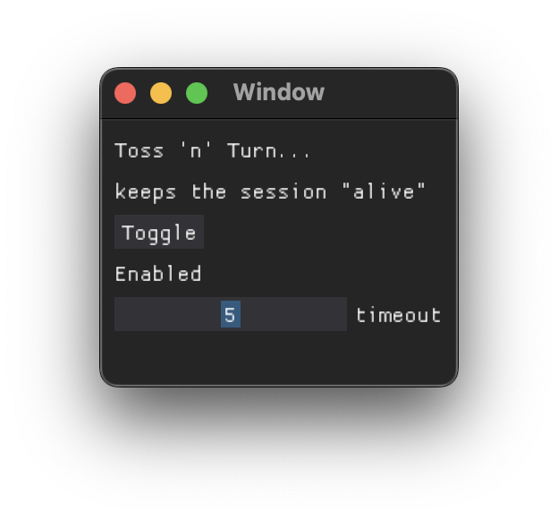

# Toss 'n' Turn

A simple application that keeps a session alive by emulating a mouse.

Installation is via `pip` or `pipx`

```sh
brew install pipx
pipx install tossnturn
```



To use:

```sh
tossnturn  # for a GUI
tossnturn cli  # if no gui interaction is needed
```